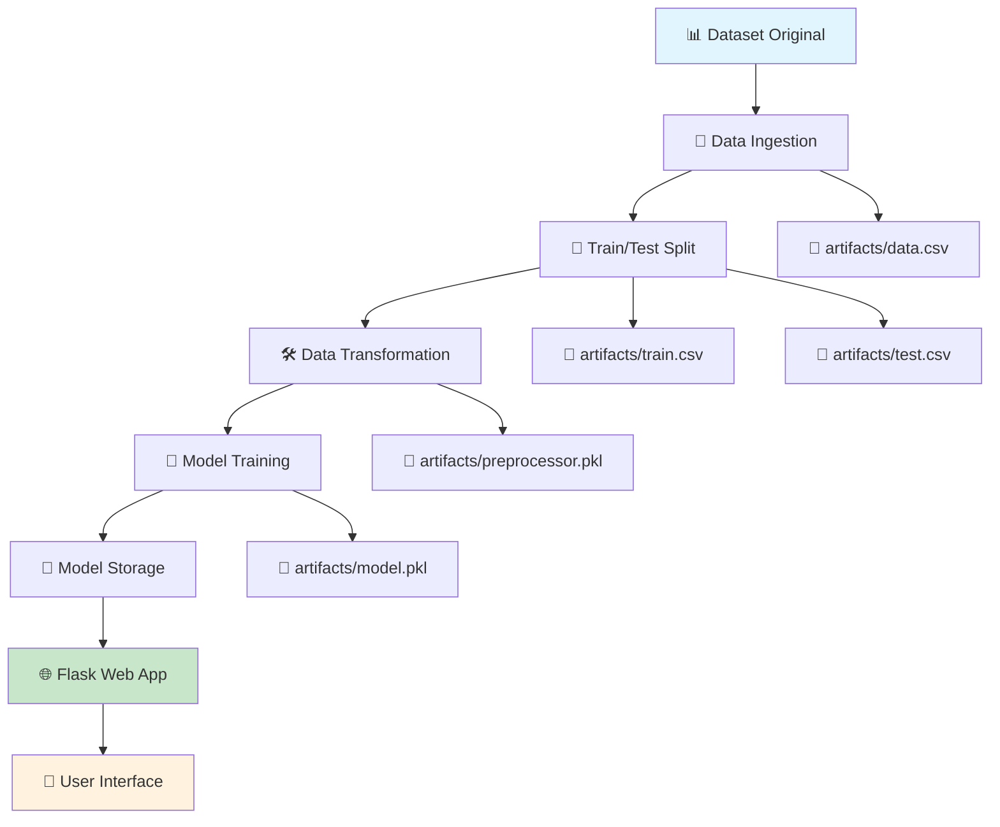

# 🎓 Student Performance Prediction - End-to-End ML Project

## 📋 Descripción del Proyecto

Este es un proyecto completo de Machine Learning que predice el rendimiento académico de estudiantes en matemáticas basándose en diversas características demográficas y educativas. El proyecto implementa un pipeline completo desde la ingesta de datos hasta el despliegue de una aplicación web.

### 🎯 Objetivo
Predecir la puntuación en matemáticas de un estudiante utilizando:
- Puntuaciones en lectura y escritura
- Características demográficas (género, etnia)
- Nivel educativo de los padres
- Tipo de almuerzo
- Curso de preparación para exámenes

## 🏗️ Arquitectura del Proyecto

```
📦 ML-project/
├── 📁 src/                          # Código fuente principal
│   ├── 📁 components/               # Componentes del pipeline ML
│   │   ├── 📄 data_ingestion.py     # Carga y división de datos
│   │   ├── 📄 data_transformation.py # Preprocesamiento de datos
│   │   └── 📄 model_trainer.py      # Entrenamiento de modelos
│   ├── 📁 pipeline/                 # Pipelines de predicción
│   │   ├── 📄 predict_pipeline.py   # Pipeline de predicción
│   │   └── 📄 train_pipeline.py     # Pipeline de entrenamiento
│   ├── 📄 exception.py              # Manejo de excepciones
│   ├── 📄 logger.py                 # Sistema de logging
│   └── 📄 utils.py                  # Funciones utilitarias
├── 📁 templates/                    # Templates HTML para Flask
│   ├── 📄 home.html                 # Página de predicción
│   └── 📄 index.html                # Página principal
├── 📁 notebook/                     # Análisis exploratorio (EDA)
│   ├── 📄 1. EDA STUDENT PERFORMANCE.ipynb
│   └── 📁 data/
│       └── 📄 stud.csv              # Dataset original
├── 📁 artifacts/                    # Modelos y objetos entrenados
│   ├── 📄 model.pkl                 # Modelo entrenado
│   ├── 📄 preprocessor.pkl          # Objeto de preprocesamiento
│   ├── 📄 train.csv                 # Datos de entrenamiento
│   ├── 📄 test.csv                  # Datos de prueba
│   └── 📄 data.csv                  # Datos originales procesados
├── 📄 app.py                        # Aplicación Flask
├── 📄 requirements.txt              # Dependencias
└── 📄 setup.py                      # Configuración del paquete
```

## 🔄 Flujo de Datos y Arquitectura



## 🧩 Componentes Detallados

### 1. 📥 Data Ingestion (`data_ingestion.py`)

**Función**: Carga y prepara los datos iniciales

```python
# Funcionalidades principales:
✅ Carga el dataset desde notebook/data/stud.csv
✅ Divide los datos en conjuntos de entrenamiento y prueba (80/20)
✅ Guarda los archivos en la carpeta artifacts/
✅ Retorna las rutas de los archivos procesados
```

**Flujo de trabajo**:
1. Lee el archivo CSV original
2. Crea la estructura de directorios `artifacts/`
3. Divide los datos usando `train_test_split`
4. Guarda: `data.csv`, `train.csv`, `test.csv`

### 2. 🔧 Data Transformation (`data_transformation.py`)

**Función**: Preprocesa y transforma los datos para el modelo

**Variables del Dataset**:
- **Numéricas**: `writing_score`, `reading_score`
- **Categóricas**: `gender`, `race_ethnicity`, `parental_level_of_education`, `lunch`, `test_preparation_course`
- **Target**: `math_score` (variable a predecir)

**Pipelines de Transformación**:

```python
# Pipeline Numérico:
🔹 SimpleImputer(strategy="median")     # Rellena valores faltantes
🔹 StandardScaler()                     # Normalización (μ=0, σ=1)

# Pipeline Categórico:
🔹 SimpleImputer(strategy="most_frequent")  # Rellena con moda
🔹 OneHotEncoder()                          # Codificación dummy
🔹 StandardScaler(with_mean=False)          # Normalización sin centrar
```

### 3. 🤖 Model Trainer (`model_trainer.py`)

**Función**: Entrena y evalúa múltiples modelos de ML

**Modelos Implementados**:
- 🌳 Random Forest Regressor
- 🌲 Decision Tree Regressor  
- 📈 Gradient Boosting Regressor
- 📏 Linear Regression
- 🚀 XGBoost Regressor
- 🐱 CatBoost Regressor
- 🔄 AdaBoost Regressor

**Proceso de Entrenamiento**:
1. Separación de features (X) y target (y)
2. Entrenamiento con GridSearchCV para optimización de hiperparámetros
3. Evaluación usando R² Score
4. Selección del mejor modelo
5. Guardado del modelo en `artifacts/model.pkl`

### 4. 🔮 Prediction Pipeline (`predict_pipeline.py`)

**Función**: Maneja las predicciones en producción

**Componentes**:
- **PredictPipeline**: Carga modelo y preprocessor, realiza predicciones
- **CustomData**: Estructura los datos de entrada del usuario

### 5. 🌐 Flask Web Application (`app.py`)

**Función**: Interfaz web para interactuar con el modelo

**Rutas**:
- `/`: Página principal
- `/predictdata`: Formulario de predicción (GET/POST)

## 🚀 Instalación y Configuración

### Prerrequisitos
```bash
Python 3.11.4+
pip
```

### 1. Clonar el Repositorio
```bash
git clone https://github.com/Camilossa/ML-Project.git
cd ML-project
```

### 2. Crear Entorno Virtual
```bash
python3 -m venv venv
source venv/bin/activate  # En Windows: venv\Scripts\activate
```

### 3. Instalar Dependencias
```bash
pip install -r requirements.txt
```

### 4. Ejecutar el Pipeline de Entrenamiento
```bash
python3 src/components/data_ingestion.py
```

### 5. Lanzar la Aplicación Web
```bash
python3 app.py
```

La aplicación estará disponible en: `http://localhost:8080`

## 📊 Dataset

**Fuente**: Student Performance Dataset
**Registros**: ~1000 estudiantes
**Features**: 8 variables (5 categóricas, 2 numéricas, 1 target)

### Descripción de Variables:

| Variable | Tipo | Descripción |
|----------|------|-------------|
| `gender` | Categórica | Género del estudiante (male/female) |
| `race_ethnicity` | Categórica | Grupo étnico (group A-E) |
| `parental_level_of_education` | Categórica | Nivel educativo de los padres |
| `lunch` | Categórica | Tipo de almuerzo (standard/free or reduced) |
| `test_preparation_course` | Categórica | Curso de preparación (completed/none) |
| `reading_score` | Numérica | Puntuación en lectura (0-100) |
| `writing_score` | Numérica | Puntuación en escritura (0-100) |
| `math_score` | Numérica | **Puntuación en matemáticas (TARGET)** |

## 🔧 Tecnologías Utilizadas

### Machine Learning
- **scikit-learn**: Modelos base y preprocesamiento
- **XGBoost**: Gradient boosting optimizado
- **CatBoost**: Manejo especializado de variables categóricas
- **pandas/numpy**: Manipulación de datos

### Web Framework
- **Flask**: Framework web para la aplicación
- **HTML/CSS**: Interface de usuario

### DevOps y Utilidades
- **pickle/dill**: Serialización de modelos
- **logging**: Sistema de logs
- **dataclasses**: Estructuras de configuración

## 📈 Rendimiento del Modelo

El sistema evalúa automáticamente múltiples modelos y selecciona el mejor basándose en el R² Score. Los modelos típicamente logran:

- **R² Score**: 0.85-0.92
- **RMSE**: 5-8 puntos
- **Tiempo de entrenamiento**: 2-5 minutos

## 🌐 Uso de la Aplicación Web

### Interfaz de Usuario

1. **Página Principal** (`/`): Bienvenida al sistema
2. **Formulario de Predicción** (`/predictdata`):
   - Seleccionar características del estudiante
   - Ingresar puntuaciones de lectura y escritura
   - Obtener predicción de matemáticas

### Ejemplo de Uso:
```
Entrada:
- Género: Female
- Etnia: Group C
- Educación Padres: Bachelor's degree
- Almuerzo: Standard
- Curso Preparación: Completed
- Lectura: 85
- Escritura: 88

Salida: Predicción Matemáticas: 87.3
```

## 🔄 Pipeline de Desarrollo

### Para Entrenar un Nuevo Modelo:
```bash
# 1. Actualizar datos en notebook/data/stud.csv
# 2. Ejecutar pipeline completo
python3 src/components/data_ingestion.py

# 3. Los artefactos se generan automáticamente en artifacts/
```

### Para Hacer Predicciones:
```python
from src.pipeline.predict_pipeline import PredictPipeline, CustomData

# Crear datos de ejemplo
data = CustomData(
    gender="female",
    race_ethnicity="group C",
    parental_level_of_education="bachelor's degree",
    lunch="standard",
    test_preparation_course="completed",
    reading_score=85,
    writing_score=88
)

# Realizar predicción
pipeline = PredictPipeline()
result = pipeline.predict(data.get_data_as_data_frame())
print(f"Predicción: {result[0]}")
```

## 📝 Logging y Monitoreo

El sistema incluye logging comprehensivo:
- **Ubicación**: `logs/` (generados automáticamente)
- **Formato**: Timestamp, línea, nivel, mensaje
- **Cobertura**: Todos los componentes del pipeline

## 🚨 Manejo de Errores

Sistema robusto de manejo de excepciones:
- **CustomException**: Excepciones personalizadas con contexto
- **Error tracking**: Archivo, línea, mensaje detallado
- **Graceful fallbacks**: El sistema continúa funcionando ante errores menores

## 🤝 Contribuciones

Para contribuir al proyecto:

1. Fork el repositorio
2. Crea una rama feature (`git checkout -b feature/nueva-funcionalidad`)
3. Commit tus cambios (`git commit -m 'Añadir nueva funcionalidad'`)
4. Push a la rama (`git push origin feature/nueva-funcionalidad`)
5. Crear Pull Request

## 📄 Licencia

Este proyecto está bajo la Licencia MIT. Ver archivo `LICENSE` para más detalles.

## 👨‍💻 Autor

**Juan Camilo Ossa Giraldo**
- Email: ossagiraldojuancamilo@gmail.com
- GitHub: [@Camilossa](https://github.com/Camilossa)

## 📌 Notas Adicionales

> **Nota Importante**: La carpeta `notebook/` contiene el análisis exploratorio de datos (EDA) que sirvió como base para desarrollar el código modular. Es una referencia de cómo se desarrolló la lógica que luego se implementó en los componentes del pipeline.

---

⭐ **Si este proyecto te fue útil, no olvides darle una estrella en GitHub!**